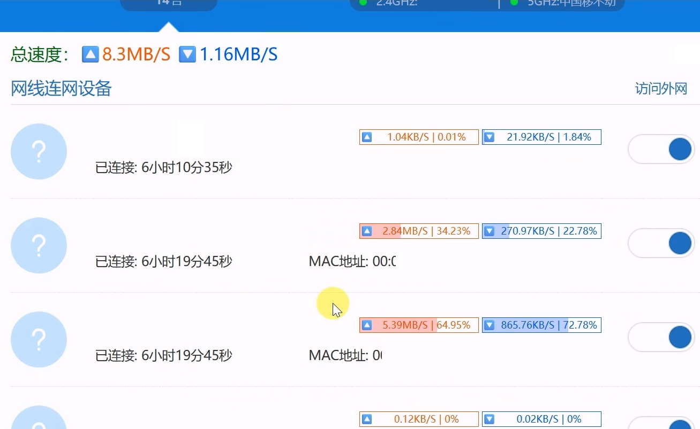
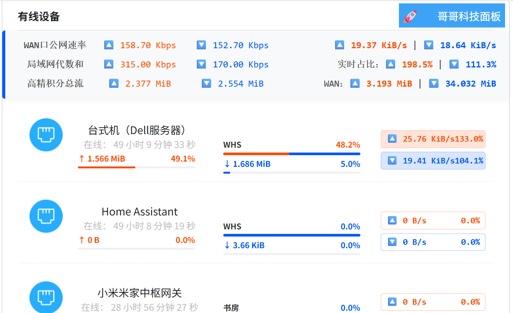

# ZTE-Stat_Max

[](https://github.com/YourName/ZTE-Dashboard_Max)
[](https://www.gnu.org/licenses/gpl-3.0.html)
[](https://www.tampermonkey.net/)

[English](README_EN.md) | **简体中文**

**ZTE-Stat_Max** 是一款专为中兴（ZTE）路由器 Web 管理后台设计的 Tampermonkey 增强脚本。

本脚本通过接管原生 Vue 框架的底层 XML API 数据流，在不破坏官方原有拓扑与结构的前提下，重构了“组网管理”与“接入设备”页面的 UI 布局。引入了梯形积分算法、异常流量雷达以及双轨制流量对齐显示，为网络工程人员和进阶玩家提供。

中兴路由器Web UI增强插件，已验证：星云MAX全屋2.5G有线主路由/BE 5100Pro+ ！分别统计上下行流量，查看流量占比速率、上下比值，打击P2P偷上行，支持1000/1024进制，支持Mbps/GiB，可统计内网和公网作对比！设备列表平铺化，大屏可视化一点通，你所要的，都在这里，无需频繁切换页面…

官方 Web 后台虽然稳定，但在数据展示的交互设计上存在一些不便。例如，实时的网速数据和设备历史累积流量被隐藏在了二级菜单中，需要频繁点击具体设备才能查看，无法在全局列表形成直观的对比。本插件的核心目的就是“拍平”这些层级。将单台设备的上下行网速、本次在线期间的积分流量，以及底层的累积总吞吐量，全部提取并前置到主设备列表中，无需任何多余的操作，所有设备的网络吞吐状态一目了然。

## ✨ 功能特性 (Features)

* **流量与占比统计**：分别统计单设备的上下行流量，实时查看流量占比速率及上下行比值。
* **异常上传监控**：支持检测上下行比例，直观标记异常上传，打击 PCDN / P2P 偷跑上行。
* **精准单位换算**：严格区分网络传输速率与存储容量，支持 1000/1024 双进制，支持 Mbps / GiB 显示。
* **全局数据对比**：支持内网（局域网代数和）与公网（WAN口）数据大盘统计与直观对比。
* **高精积分流量统计 ⏱️  UI 栅格重构 🖥️**

* **双轨制流量统计对比**：除展示路由器接口自带的历史总吞吐量外，还会在页面前端独立进行高频的数据采样，统计设备在当前页面打开期间的真实流量消耗。两者并排显示，互为参考。单位统一成本次，注重变化的观察。
* **自定义支持**：尊重网络工程习惯，支持通过脚本变量自定义 1000 进制 Mbps、1024 进制 MiB/s 显示逻辑。
* **🛡️ 隐私保护、UI 优化**：
  * DOM 原地突变（Mutation）渲染时，自动覆写敏感的 MAC 地址与 IPv6 临时地址，确保在录屏、截屏及分享网络状态时的安全。
  * 基于 Flexbox 的强制底部对齐系统，修复栅格导致的高度差问题。
  * 无痕注入，不破坏原生 Vue 状态机，保障浏览器运行性能。

## 📸 界面预览 (Screenshots)

| 小米插件参考|中兴原生界面 | 增强版 |
| :---: | :---: | :---: |
|  |  |  |


## 🚀 安装指南 (Installation)

### 环境要求
在使用本脚本之前，请确保您的浏览器已安装用户脚本管理器扩展，例如：
* **[Tampermonkey](https://www.tampermonkey.net/)** (推荐, 支持 Chrome, Edge, Firefox, Safari)
* **[Violentmonkey](https://violentmonkey.github.io/)**

### 脚本安装
1.  点击此处安装全面版ZTE-Stat_Max：

    **[从GitHub安装](https://github.com/ucxn/ZTE-Stat_Max/releases/latest)**&nbsp;&nbsp;&nbsp;&nbsp;&nbsp;&nbsp;**[从GreasyFork安装](https://greasyfork.org/zh-CN/scripts/576199-%E4%B8%AD%E5%85%B4%E8%B7%AF%E7%94%B1%E5%99%A8ui%E5%A2%9E%E5%BC%BA%E6%8F%92%E4%BB%B6-zte-web%E8%84%9A%E6%9C%AC)**
2.  在弹出的 Tampermonkey 界面中点击 **“安装”** 或 **“更新”**。
3.  登录您的中兴路由器 Web 管理后台，*输入管理员密码*，登录成功后 *刷新网页* ,进入“组网管理”或“接入设备”页面，脚本将自动生效。

## ⚙️ 个性化配置 (Configuration)

脚本顶部暴露了全局环境变量 `CONFIG` 对象，支持用户根据自身网络环境进行微调：

```javascript
const CONFIG = {
    calcMode: 1,            // 1: 绝对倍数模式 (上行/下行), 0: 传统占比模式
    ratioExtremeUp: 10,     // 极端上传触发阈值 (默认 1000%，触发红色⚠️告警)
    ratioWarnUp: 0.07,      // 重度上传触发阈值 (默认 7%，触发红色高亮)
    ratioExtremeDown: 0.01, // 极端下载触发阈值 (默认 1%，触发蓝色下载倍数显示)
    
    // 物理端口与无线频段中文映射字典 (可根据你的具体路由型号增删)
    portMap: {
        "eth1": "端口 1",
        "eth2": "端口 2",
        "eth3": "端口 3",
        "eth4": "端口 4",
        "wl0":  "Wi-Fi 2.4G",
        "wl1":  "Wi-Fi 5.2G",
        "wl2":  "Wi-Fi 5.8G"
    }
};
```

## ⚠️ 注意事项 (Notes)

* 本脚本仅在前端对获取到的 API 数据进行重新排版与计算，不会修改路由器底层的核心配置。
* 若您的路由器管理地址为非标准 IP，请在脚本的 `@match` 或 `@include` 头部规则中自行添加。


* 本脚本属于纯前端 DOM 注入与数据重组工具，不涉及对中兴路由器底层固件的修改。
脚本利用油猴环境，并发请求路由器的 `vue_home_device_data_no_update_sess` 和 `vue_client_data` 接口。为解决官方前端轮询刷新带来的滞后感，脚本内部通过 `performance.now()` 实现了独立的设定，从而推导出更为精准的瞬时流量数据。所有的 UI 修改均在原页面的 CSS 框架基础上通过Mutation完成，确保了界面的原生质感与兼容性。


## 📄 协议 (License)

[GNU-GPL 3.0](https://www.gnu.org/licenses/gpl-3.0.html)

---
*Authored by 哥哥科技*
