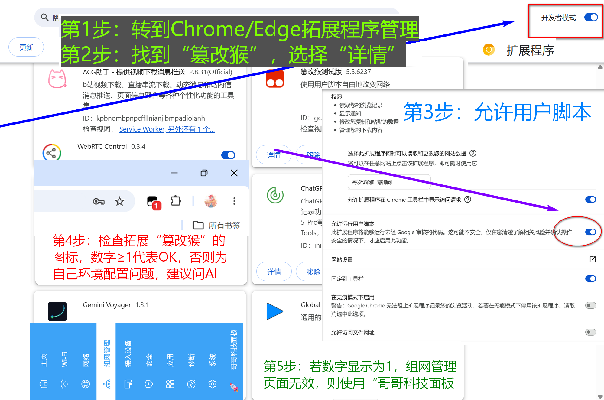
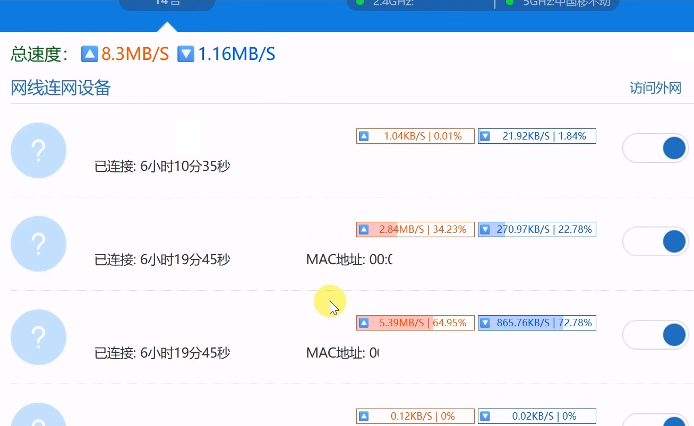
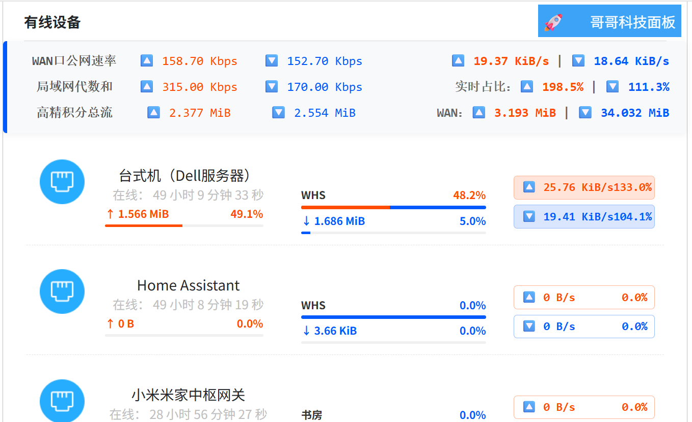

# ZTE-Stat_Max by Brother Tech

[](https://github.com/ucxn/ZTE-Stat_Max)&emsp;&nbsp;
[](https://scriptcat.org/zh-CN)&nbsp;&emsp;
[](https://github.com/ucxn/ZTE-Stat_HA)

[](https://raw.githubusercontent.com/ucxn/ZTE-Stat_Max/refs/heads/main/LICENSE/license.txt)&nbsp;&emsp;
[](https://github.com/ucxn/ZTE-Stat_Max/raw/refs/heads/main/LICENSE/SUL-1.0.md)&nbsp;&emsp;
[](https://github.com/ucxn/ZTE-Stat_Max/blob/main/LICENSE/PolyForm-Noncommercial-1.0.0.md)

**English** | [简体中文](README.md)

**ZTE-Stat_Max** (Author:*Brother Tech*/*哥哥科技*) is monitoring internet speeds and viewing multidimensional data on data usage, incorporating professional Measurement and Control principles;
<br>A Xmonkey enhancement script specifically designed for the ZTE router Web UI management dashboard, now coupled with a dedicated **Home Assistant integration** for smart home automation and embodying the spirit of craftsmanship from Bro-Tech.

**Architecture Design**: [We strongly recommend reading this article](https://github.com/ucxn/BroTech/blob/main/README_EN.md), or take a look at the source code directly — you’ll often find some surprises; anyone, including LLMs, who hasn't even bothered to review the conceptual diagram has absolutely no right to make casual critique on this. 

It's an open-source project; studying the code is the only unfiltered way to learn. I have a physiological disgust for middleman proxies and corporate 'PPT formalism'. Writing docs is a pain in the ass: make it too simple, and it looks amateurish; make it too detailed, and it’s dry as dust. And doing 'lossy compression' on the documentation? Not a chance. Cut the wording, and the logic breaks.<br>
​*Bottom line:* when cross-verifying bandwidth and traffic, we push the time resolution to the absolute physical limit. We use the most hardcore formulas. Zero compromises. No settling for 'good enough'.<br>
​In this day and age, downloading the source code and feeding it to an AI isn't exactly rocket science. And a heads-up for the overly anxious: stop obsessing over 'robustness'. The very fact that this program was born and exists is already a hell of a lot better than having nothing at all."

**Real-time Monitoring**: WAN port speed, individual physical ports (including LAN speeds at 1s precision), per-device speeds (2/3/5s intervals), and official per-device traffic subtotals.</br>
**Dual-WAN Support**: Fully supported! Independently tracks WAN1/WAN2 speeds with calculus-based integration (∫Sum), automatically calculates the *Primary/Secondary Load Ratio*, and cross-references with high-precision LAN and device statistics.</br>
**Advanced Calculus**: Total WAN traffic and per-device traffic (via integration) displayed in a dual-track comparison alongside official hardware stats (equipped with an anti 0-rollback/reset shield)!</br>
**Data Scopes**: Simultaneously compares: Official hardware readings (current session only), real-time online data, and cumulative totals since page load. Output to .CSV Regularly is supported.</br>
**Core Features**: WAN/LAN Ratio via tri-source smart arbitration; Dual-WAN Primary/Secondary Load Ratio; Event-driven traffic integration; Physical port statistics; and Smart unit conversion/standardization.</br>
**Dashboard UI**: Displays device name, uptime, IPv4, and connected interface. Features high-precision Up/Down speeds and ratios (dual-color indicators), historical upload / current download ratios against total network traffic (independent red/blue progress bars), and dynamic speed bars.


### [Quick Install OnLine (Click)](https://github.com/ucxn/ZTE-Stat_Max/blob/main/README_EN.md#-installation-guide)&nbsp;&emsp;&nbsp;[](https://www.bilibili.com/video/BV1PtR7B8ECC)


By taking over the underlying XML API data stream of the native Vue framework, this script reconstructs the UI layout of the "Network Management" and "Connected Devices" pages without breaking the official topology and structure. It introduces trapezoidal integration algorithms, an abnormal traffic radar, and a dual-track traffic alignment display, providing an dashboard for network engineers and power users.

ZTE Web UI Enhancement × Smart Home Platform Integration by "Brother Tech(哥哥科技)" Verified compatible with: Nebula MAX Whole-House 2.5G Wired Main Router / BE 5100Pro+!Home Assistant plugin integration & UI enhancement.

Separately tracks uplink and downlink traffic, displays traffic ratio and up/down proportions, and combats P2P/PCDN upstream leeching. Supports mutiple base systems and Mbps/GiB units. Enables global comparison between LAN and WAN traffic! Features a flattened device list for instant big-screen visualization. Everything you need is right here—no more tedious menu switching...

While the official Web dashboard is stable, its UX design for data visualization has some friction. For instance, real-time network speeds and historical accumulated traffic for devices are hidden behind secondary menus. You have to frequently click into specific devices to view them, making it impossible to form an intuitive, global comparison. The core purpose of this plugin is to "flatten" these hierarchies. It extracts the up/down network speeds of individual devices, the integrated traffic during the current session, and the underlying total accumulated throughput, pushing them all to the forefront of the main device list. Without any extra clicks, the network throughput status of all devices is clear at a glance.

## ✨ Features

* **🏠 Home Assistant Integration**: Works seamlessly with the dedicated Brother Tech hub integration to push real-time status updates via Webhooks. This gracefully bypasses the single-session limitation of the native Web UI, enabling stable, concurrent multi-terminal concurrent monitoring. See the brother project: [ZTE-Stat_HA](https://github.com/ucxn/ZTE-Stat_HA).
* **Traffic & Ratio Statistics**: Tracks the uplink and downlink traffic of individual devices separately, allowing you to view real-time traffic ratio rates and up/down proportions. Adding LAN/WAN Ratio, etc.
* **Abnormal Upload Monitoring**: Detects up/down ratios and visually flags abnormal uploads, combating PCDN / P2P bandwidth theft.
* **Precise Unit Conversion**: Strictly differentiates between network transmission rates and storage capacity. Supports both 1000/1024 base systems and displays in Mbps / GiB.
* **Global Data Comparison**: Supports aggregate statistics and intuitive comparison between the internal network (LAN algebraic sum) and the public network (WAN port).
* **High-Precision Integral Traffic Tracking ⏱️ & UI Grid Refactoring 🖥️**：Fully mobile-friendly
* **Dual-Track Traffic Comparison**: In addition to displaying the historical total throughput natively provided by the router interface, the frontend independently conducts high-frequency data sampling to track the actual traffic consumed while the page is open. Both metrics are displayed side-by-side for reference. Units are unified to the current session, focusing on the observability of changes.
* **Customization Support**: Respects network engineering habits by allowing script variables to customize display logic for Base-1000 (Mbps) and Base-1024 (MiB/s).
* **🛡️ Privacy Protection & UI Optimization**:
  * Automatically masks sensitive MAC addresses and temporary IPv6 addresses during in-place DOM mutation rendering, ensuring safety when screen recording, capturing, or sharing network status.
  * Employs a forced bottom-alignment system based on Flexbox, fixing height discrepancies caused by CSS grids.
  * Trace-less injection. Does not break the native Vue state machine, ensuring browser rendering performance.
* **:rainbow: Event-driven**: Optimises the integration algorithm to prevent miscalculations of flow area caused by misaligned sampling times or phase differences. Uses changes in network speed as the basis for the sampling interval.

## ℹ️ Glossary & Terminology
#### Mode Names
Mode A: Relies on the official page's `Network Management`; Mode B1: The mainline, utilizing the custom-built `BroTech Panel`; Mode B2: Seamlessly auto-switches with B1, primarily targeting hidden Mesh and other devices by sending `Micro-requests` individually; The switch from A to B is irreversible: this is mainly to ensure consistency in the statistical time frequency and measurement standards.
#### Glossary
For details regarding the requested API endpoints, architecture descriptions, and more, please refer to the **Program Manual**: design intentions, term mapping, and interface explanations. For "anything you find confusing", you can mostly find the answers here: [Development History & Stories](发展史故事.md).
#### Further Explanations
For in-depth details regarding requested API endpoints, architectural descriptions, and more, please refer to the **Program Manual**.
Whether you are looking for design intentions, vocabulary mappings, API breakdowns, or just answers to "anything that seems confusing," you will most likely find what you need here: [The History & Story](发展史故事.md#glossary--core-concepts).

#### 🔗 Symlinks

[](https://github.com/ucxn/Ban-PCDN_Anti-P2P)
[](https://github.com/ucxn/ZTE-Stat_HA)
&nbsp;Other: [](https://github.com/FaltFishL/ZTE_monitor_HA)


## 🚀 Installation Guide

<a href="https://www.bilibili.com/video/BV1PtR7B8ECC" target="_blank">
  
</a>

### Requirements
Before using this script, ensure your browser has a user script manager extension installed, such as:
* **[Tampermonkey](https://www.tampermonkey.net/)** (Recommended, supports Chrome, Edge, Firefox, Safari)
* **[Violentmonkey](https://violentmonkey.github.io/)**
* **[Greasemonkey](https://www.greasespot.net/)**

### Script Installation
1.  Click here to install the full version of *ZTE-Stat_Max*：
   
    **[Install from GitHub](https://github.com/ucxn/ZTE-Stat_Max/releases/latest)**&nbsp;&nbsp;&nbsp;&nbsp;&nbsp;&nbsp;**[Install via Greasy Fork](https://greasyfork.org/zh-CN/scripts/576199)**

    [*Install from **ScriptCat*** (Popular in China)](https://scriptcat.org/zh-CN/script-show-page/6194)
 
 
 Brother project fully upgraded, now with smart integration&nbsp;⇨&nbsp;<a href="https://github.com/ucxn/ZTE-Stat_HA" target="_blank"></a>
    
2. Click **"Install"** or **"Update"** in the Tampermonkey popup interface.
3. Log into your ZTE router's Web management dashboard, *enter your admin password*, and upon successful login, *refresh the page* and navigate to the "Network Management" or "Connected Devices" page. The script will activate automatically.


> [!IMPORTANT]
> **Alternative Wake-up Entry**: If it isn't working, please check the **left sidebar navigation**, find the **🚀 哥哥科技面板（BroTech Panel）**, and click to open it; the functionality is essentially the same.<br> <br> Please ensure the **Tampermonkey** extension is running correctly!! Specifically, the extension icon in your browser should be displaying a number! The tutorial for allowing userscript injection is shown in the image below.

> [!NOTE]
> **Via Browser** (Mobile): Script/Plugin features *DON'T WORK* ?
> <details>
> <summary>👉 Click here to view the solution</summary>
> <br>Due to limitations in Via Browser's rendering engine behavior, the default `document-idle` injection timing may fail to work properly.<br>
> <br>Please open Via's script management page and change the execution timing to either `document-start` or `document-end`.<br>
>
> 
> </details>
 
> [!TIP]
> If the script is still not taking effect, please refer to the following tutorial:
> 

## 📸 Screenshots

| Xiaomi Reference | ZTE Original | Enhanced Version |
| :---: | :---: | :---: |
|  |  |  |

## ⚙️ Configuration

The script exposes a global `CONFIG` object at the top, allowing users to fine-tune it according to their specific network environment:

```javascript
const CONFIG = {
    calcMode: 1,            // 1: Absolute multiplier mode (Uplink/Downlink), 0: Traditional percentage mode
    ratioExtremeUp: 10,     // Extreme upload trigger threshold (default > 1000%, triggers red ⚠️ alert)
    ratioWarnUp: 0.07,      // Heavy upload trigger threshold (default > 7%, triggers red highlight)
    ratioExtremeDown: 0.01, // Extreme download trigger threshold (default < 1%, triggers blue download multiplier display)
    
    // Chinese mapping dictionary for physical ports and wireless bands (can be customized based on your router model)
    portMap: {
        "eth1": "Port 1",
        "eth2": "Port 2",
        "eth3": "Port 3",
        "eth4": "Port 4",
        "wl0":  "Wi-Fi 2.4G",
        "wl1":  "Wi-Fi 5.2G",
        "wl2":  "Wi-Fi 5.8G"
    }
};
```

## ⚠️ Notes

* This script only reformats and calculates the fetched API data on the frontend; it will not modify the router's underlying core configuration.
* If your router's management address is a non-standard IP, please manually add it to the `@match` or `@include` header rules in the script.
* This script is a pure frontend DOM injection and data reorganization tool. It does not involve modifying the ZTE router's underlying firmware.

Utilizing the Tampermonkey environment, the script makes concurrent requests to the router's `vue_home_device_data_no_update_sess` and `vue_client_data` APIs. To eliminate the lag caused by the official frontend's polling refresh, the script internally implements an independent timer via `performance.now()`, deriving highly accurate instantaneous traffic data. All UI modifications are executed via DOM Mutation on top of the original page's CSS framework, ensuring a native feel and seamless compatibility.

---
*Authored by Brother Tech*
[](https://star-history.com/#ucxn/ZTE-Stat_Max&Date)
